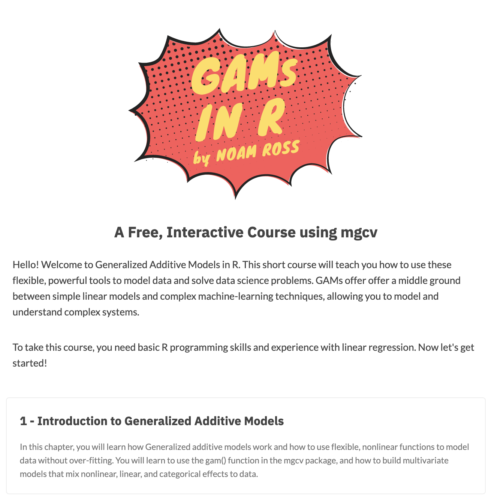
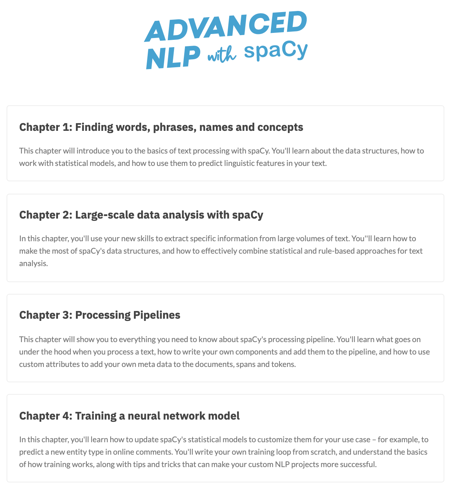
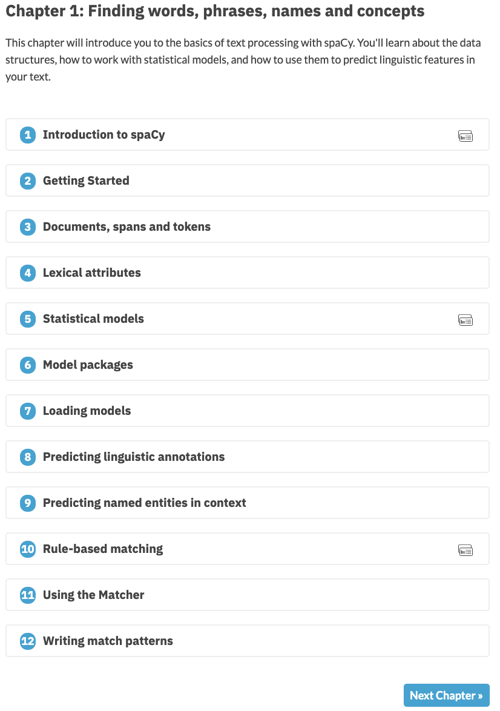
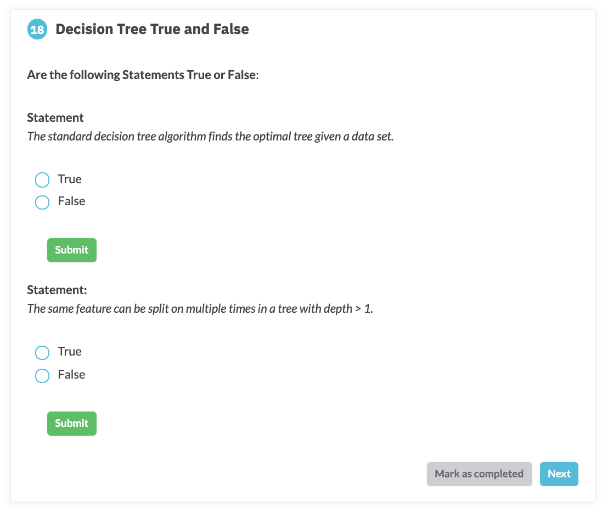

# From Zero to ICSP (Ines Course Starter - Python)

Table of Contents
=================

   * [From Zero to ICSP (Ines Course Starter - Python)](#from-zero-to-icsp-ines-course-starter---python)
      * [What to Expect](#what-to-expect)
      * [Creating Your Website Without Installing Dependencies (Using Docker Compose)](#creating-your-website-without-installing-dependencies-using-docker-compose)
      * [Creating your website by Installing Dependencies](#creating-your-website-by-installing-dependencies)
         * [Install Node](#install-node)
         * [Install Gatsby](#install-gatsby)
         * [Clone or Install the Repository](#clone-or-install-the-repository)
         * [Running on local Server](#running-on-local-server)
      * [Repository Structure](#repository-structure)
      * [Customization](#customization)
         * [Course Homepage Information](#course-homepage-information)
         * [theme.sass](#themesass)
         * [Introduction on Homepage](#introduction-on-homepage)
      * [Contents](#contents)
         * [Chapters](#chapters)
         * [Slides](#slides)
            * [Embedding Video and Audio](#embedding-video-and-audio)
         * [Multiple choice questions:](#multiple-choice-questions)
            * [<g-emoji class="g-emoji" alias="high_brightness" fallback-src="https://github.githubassets.com/images/icons/emoji/unicode/1f506.png">🔆</g-emoji>You can have several questions in one exercise container](#you-can-have-several-questions-in-one-exercise-container)
         * [Codeblock Exercises:](#codeblock-exercises)
            * [Let's talk about importing functions!](#lets-talk-about-importing-functions)
            * [binder/requirements.txt](#binderrequirementstxt)
         * [static folder](#static-folder)


Course Starter python is a starter repo based on the course framework [Ines Montani](https://ines.io/) developed for her [online open-source spaCy course](https://course.spacy.io/). Since creating this framework in April 2019, it has since become a useful tool and platform for data scientists and developers alike to implement their courses in a manner similar to other popular online Data science educational platforms. 

This course gives the developer the versatility of a lecture slide-type informational piece followed by multiple-choice questions and coding exercises equipped with verification of the students' submitted answers.

Ines Montani has created this framework using Gatsby and Reveal.js in the front-end and Binder and Docker in the back-end. This framework was made possible thanks to the useful JavaScript library [`Juniper`](https://github.com/ines/juniper) Ines created which can add interactive, editable and runnable code snippets to websites. 

***Please Note:***    
This project is under active development and there are possibilities of changes. If you would like to contribute or point out corrections, please create a new issue addressing your concern, suggestions or contribution. 
[](https://course-starter-python.netlify.com)

🔆 **Hot Tips:** This symbol will be used in this guide for helpful tips/recommendations and suggestions when building your course.  
    
⚠️ **Warning:** This symbol will give you preventative tips to avoid debugging or issues that I ran into.   


## What to Expect 

I hope that this thorough documentation will help you deploy, customize and troubleshoot your starter course. Ines provides some wonderful instructions in her `README.md` file, but I noticed there were a few notes I wanted to add to it for my colleagues and others attempting to make their course so that they can save time on troubleshooting. 

You will be working with different file types including `.md` (and potentially `.rmd`), `.json`, `.py` and `.txt`. 
You may need to know _some_ Html for additional customization, however by no means in-depth. 

This tutorial will describe the steps to create a complete initial "Starter Course" with zero customization. From here we will then change, edit and add files to complete your desired unique course. 

You can choose either to create your website by [installing the dependencies (Node and Gatsby)](#creating-your-website-by-installing-dependencies) or we have conveniently made a docker compose file available to avoid that. If you don't want to install the dependencies follow the steps [here](#creating-your-website-without-installing-dependencies-using-docker-compose)

## Creating Your Website Without Installing Dependencies (Using Docker Compose) 

1. Clone this repo [starter course repo](https://github.com/UBC-MDS/course-starter-python)
and locate yourself to the root of the repo where the `Dockerfile` is located.   

2. Run the following command. It should take about 1 or 2 to run.  
```
docker-compose up
```
You will know when it is done when you see: 
```
You can now view course-starter-python in the browser.
``` 

3. Go to your favourite web browser and type this in the search bar:  
[http://0.0.0.0:8000/](http://0.0.0.0:8000/)


This should be the beginning of a functioning starter-course! 


Now that you have a website that is deploying on your local server, we can now begin the steps to customize it to your own taste. 


## Creating your website by Installing Dependencies 

### Install Node 

**Mac instructions** 

_Make sure that you have homebrew installed in order to download `Node`_

The most important part of this installation is making sure that you are running some version of 10. 


Check if you have `Node` installed already by using the command :
```
node --version
``` 

If that produces an error then you can simply download version 10 with the following command: 

```
brew install node@10
```

If it's a version other than 10, you will **need** to downgrade/upgrade to version 10 - or Gatsby will not be able to start a development server or build a page. 

To change to version 10, follow the following commands:

```
brew search node
```
This will give you an output similar to this: 

```
==> Formulae
libbitcoin-node   node-build     node@12       nodeenv
llnode       node-sass      node_exporter    nodenv
node ✓       node@10       nodebrew
```

Next, you will want to install version 10 with the command: 

```
brew install node@10
```

if the checkmark is currently on `node` we then unlink node from its current version first using: 

```
brew unlink node
```

Everyone will need to link version 10 that was just installed: 

```
brew link node@10
```

This will likely need to be forced and thus will require: 

```
brew link --force --overwrite node@10
```

You may also be prompted to specify that you need to have node@10 first in your PATH so you should run the command below before attempting force linking node@10 (the command above) again:

```
 echo 'export PATH="/usr/local/opt/node@10/bin:$PATH"' >> ~/.bash_profile 
 ```

Next check again what version you are running to confirm that it is a version of 10. 
there is a possibility that an error will be produced so you can either permanently set your 
```
node --version
``` 
this should output the following: 

```
v10.13.0
```

Now that we have this done, Gatsby's installation and building process should be much easier. 

### Install Gatsby 

This should a single command to complete this and will install Gatsby globally on your computer. 

```
npm install -g gatsby-cli
```
***⚠️ Warning: Do not update your dependencies here.***

### Clone or Install the Repository

There are 2 methods in which this step can be done.

a) Simply clone the [starter course repo](https://github.com/ines/course-starter-python) and initialize it as a [GitHub repository](https://help.github.com/en/github/importing-your-projects-to-github/adding-an-existing-project-to-github-using-the-command-line)
b) [Import](https://github.com/new/import) and install this repo

Make sure that you ***merge all the changes on the other branches to the master one** if you do not create a pull request for `electron` and `feature/deep-links` branches your course will not successfully deploy.*

Once you have done this you will need to locate yourself to the root of the repo. 

### Running on local Server 

Next, we must  install all relevant dependencies by running the following: 
```
npm install 
```

***⚠️ Warning: You will be prompted to `run "npm audit fix" to fix them`.  
I do not recommend doing this as it will burn your site down.***  

The output below will still build your course: 
```
found 572 vulnerabilities (4 low, 4 moderate, 564 high)
```

and finally, to build the site on your local:

```
npm run dev    
```

Delivering this as an output (copy and paste this address into any browser) : 
```
You can now view course-starter-python in the browser.

  http://localhost:8000/
```
**Quick link:** [http://localhost:8000/](http://localhost:8000/)

This should be the beginning of a functioning starter-course! 


Now that you have a website that is deploying on your local server, we can now begin the steps to customize it to your own taste. 


## Repository Structure 

See the architecture below. Make sure to add this to your path when calling them in your `md` file. Some of these files will be explained in further detail depending on if customization or additions is required. 

```
course-starter-python
├── .gitignore          # Files you change on your local that you do not want to track changes for or commit to the repo. 
├── .prettierrc         # Adds consistency to coding style. 
├── LICENSE             # Terms able to use this platform 
├── README.md           # Documentation and Description 
├── docker-compose.yml  # This and the dockerfile and needed to create a container used to install Gatsby and node10 
├── dockerfile          # See above 
├── gatsby-browser.js    
├── gatsby-config.js    
├── gatsby-node.js      
├── main.js
├── meta.json           # Add necessary customization such as descriptions bio and branch needed to make binder from 
├── package-lock.json
├── package.json
├── theme.sass          # Can be customizable to change fonts style and size and website colours and font 
│   │
├── binder   
|   └── requirements.txt     # A file containing all the packages needed for the coding exercises
│   │
├── chapter             # n = the number of modules/chapters you want. 
|   ├── module0.md
|   ├── module1.md
|   ├── ...
|   └── moduleN.md
│   │    
├── data                # Store exercise datafiles here 
    └── exercise-data.csv
│   │
├── exercises           # This file will contain all the coding exercise scripts. 
|   ├── exercise_01.py
|   ├── solution_01.py
|   ├── test_01.py
|   ├── function.py
|   └── price_linearanalysis3.png
│   │
├── slides              # This is where the slide decks live
|   ├── module0_00.md
|   ├── ...
|   └── moduleN_nn.md
│   │
├── src                 # Don't want to go too much into this 
|   ├── markdown.js
|   ├── context.js
|   ├── components              
|   |   ├── button.js
|   |   ├── choice.js
|   |   ├── code.js
|   |   ├── exercise.js
|   |   ├── hint.js
|   |   ├── juniper.js
|   |   ├── layout.js
|   |   ├── link.js
|   |   ├── seo.js
|   |   ├── slides.js
|   |   └── typography.js
|   |   |   
|   ├── pages              
|   |   └── index.js
|   |   |
|   ├── styles               
|   |   ├── button.module.sass
|   |   ├── choice.module.sass
|   |   ├── code.module.sass
|   |   ├── exercise.module.sass
|   |   ├── hint.module.sass
|   |   ├── index.module.sass
|   |   ├── index.sass
|   |   ├── layout.module.sass
|   |   ├── link.module.sass
|   |   ├── reveal.css
|   |   ├── slides.module.sass
|   |   └── typography.module.sass
|   |   |
    └── templates              
        └── chapter.js
|   |   |
└── static               # This is where most of your media will live, be it for slides, or anything else. 
    ├── icon.png
    ├── icon_check.svg
    ├── icon_slides.svg
    ├── logo.svg
    ├── profile.jpg
    └── social.jpg


```

## Customization

There is a lot of different areas to make your site unique but below we are going to edit the files systematically. 


### Course Homepage Information 

Here is where we will be changing all the homepage information including Course Name, "About This Course", "About Me", Website and Source. All of these factors are edited in the `meta.json` file located at the root of the repo. Ines has provided [a detailed discription](https://github.com/ines/course-starter-python#metajson) of what each component is responsible for. I am simply going to add some points that could be considered helpful when navigating in these documents  

| Setting              | Additional Notes: |
| -------------------- | ----------------- |
| `courseId`           | Ines does not have this parameter in her spacy course, however, deleting this will not let the course function properly so not having this setting is not an option unless you want to explore what makes her spacy course repo different than her course-starter repo.|
| `slogan`             | This will show up once you deploy your site and it will be shown in the image of the link that you send.  |
|`juniper.repo`        | Make sure you insert your GitHub repository path ex: GitHub-login/repository-name |
| `juniper.branch`     | We will address this further when building a binder but note that the branch here specified is called binder. That means that we will need to edit the `requirements.txt` file and push it to the binder branch|

for guidance on the other settings refer to [Ines Montani's Documentation](https://github.com/ines/course-starter-python#metajson)

### `theme.sass`

This is where you can change certain design elements of the course including font size, style and colour, overall theme colour, button colour. 


### Introduction on Homepage

_It's important to attribute Noam Ross and Julia Silge's courses for this section as they are responsible for the code pasted below_ 

Unlike Ines's [Spacy Course](https://course.spacy.io/), you may want an introduction similar to what [Julia Silge](https://supervised-ml-course.netlify.com/) and [Noam Ross](https://noamross.github.io/gams-in-r-course/) did for their courses. 

They introduced their courses with a summary and course description.

|   |  |
|:---:|:---:|
| Julia Silge's course front page | Noam Ross's course front page| 

This can be done by doing the following:

- Navigate into the `src/pages/` and open `index.js` 

You will be adding a new `<section>` (Html code) under `<Layout isHome>` and between the following two lines shown below :  
```
<Layout isHome>
   <Logo className={classes.logo} aria-label={siteMetadata.title} /> # HERE
            {chapters.map(({ slug, title, description }) => (
```
Here is an example of the code you can add.

```
<section>
                <h1 className={classes.subtitle}> INSERT CATCHY TAG LINE HERE </h1>
                <div className={classes.introduction}>
                <p>
                    FILLER WORDS HERE. WHAT IS YOUR COURSE ABOUT? DINOSAURS? NEURAL NETS? HOW TO SURVIVE EVENTS WITH THE INLAWS? WRITE IT HERE! 
                </p>
                </div>
            </section>
```

Since we are adding new class names will are going to need to edit the document that formats the class name. This can be found in `src/styles/index.module.sass`. 

You will need to paste the new classes as follows below into the document. 

```
.subtitle
    font-family: var(--font-display)
    width: 600px
    height: auto
    max-width: 100%
    margin: 0 auto 1rem
    display: block
    text-align: center

.introduction
    width: var(--width-container)
    max-width: 100%
    padding: 1rem
    margin: 0 auto
    display: block
    text-align: left
```

If you want to play with the measurements this is a welcomed opportunity to customize your course further. 

This can be done by doing the following:

- Navigate into the `src/pages/index.js` 

You will be adding a new `<section>` (Html code) under `<Layout isHome>` and between the following two lines shown below:  
```
<Layout isHome>
   <Logo className={classes.logo} aria-label={siteMetadata.title} /> # HERE
            {chapters.map(({ slug, title, description }) => (
```
Here is an example of the code you can add.

```
<section>
                <h1 className={classes.subtitle}> INSERT CATCHY TAG LINE HERE </h1>
                <div className={classes.introduction}>
                <p>
                    FILLER WORDS HERE. WHAT IS YOUR COURSE ABOUT? DINOSAURS? NEURAL NETS? HOW TO SURVIVE EVENTS WITH THE INLAWS? WRITE IT HERE! 
                </p>
                </div>
            </section>
```

Since we are adding new class names will are going to need to edit the document that formats the class name. This can be found in `src/styles/index.module.sass`. 

you will need to paste the new classes as follows below into the document. 

```
.subtitle
    font-family: var(--font-display)
    width: 600px
    height: auto
    max-width: 100%
    margin: 0 auto 1rem
    display: block
    text-align: center

.introduction
    width: var(--width-container)
    max-width: 100%
    padding: 1rem
    margin: 0 auto
    display: block
    text-align: left
```

If you want to play with the measurements this is a welcomed opportunity to customize your course further. 


## Contents

This is where the majority of your course lies.

Ines Montani [discusses in detail each section](https://github.com/UBC-MDS/course-starter-python#%EF%B8%8F-content), however, there are a few little details I want to emphasize that could help as you create this site. 

### Chapters 

These are the files that make up the topics of your course and will be displayed on your course site as below: 


<font size="1" color="grey"> Source: Ines Montani from https://course.spacy.io </font>

<br> 

each `chapter.md` file will need this YAML specification that Ines explains: 

```
---
title: The chapter title
description: The chapter description
prev: /chapter1 # exact path to previous chapter or null to not show a link
next: /chapter3 # exact path to next chapter or null to not show a link
id: 2 # unique identifier for chapter
type: chapter # important: this creates a standalone page from the chapter
---
```
Here are some additional comments: 

1. Make sure each `id` is unique or you may have some issues with some modules not showing up.
2. Take care specifying the correct `prev` and `next` otherwise it could damage the flow of your material. 
3. You don't need to have the website extension of your course labeled as "chapters" if you wish to have your link extensions named something other than "chapter" in the URL, you can change the file names to `module`, `topic`, `lecture` or anything else followed by the number. Do not change the folder name and do not change the `type` in the YAML. 

Each `chapter.md` file will contain the code of what that chapter will look like. Specifically: 


<font size="1" color="grey">Source: Ines Montani from https://course.spacy.io/chapter1</font>
   
<br>

Now that we have a chapter.md file with a completed YAML, let's add the course content. 

Each numbered container displayed in the image above corresponds to an `exercise`. Each exercise needs a unique id and specified with a title. 

```
<exercise id="1" title="Title of the exercise">

something here

</exercise>
```

These exercises can in the form of different activities as well:  
1. Slides: Lecture material and content 
2. Multiple choice questions: An opportunity for students to test themselves on the material they just learned.
3. Code block exercises: An opportunity for students to test their coding skills


### Slides 

To makes your exercise a slide deck exercises you will need to do the write the following in your `chapter.md` file: 

```
<exercise id="1" title="Introduction " type="slides">

<slides source="module1_01">
</slides>

</exercise>
``` 
Notice that we specify slides using `type="slides` argument in the exercise container.

You'll also notice we are calling a source file to display our slides. These slides are stored in the `slides` folder.

[Ines explains](https://github.com/ines/course-starter-python#slides) how your slide markdown document should be structured. 

***⚠️ Warning: Be wary of trailing spaces 😵😱!!   
Although ```---``` may appear to be the same as ```--- ``` they are not and any information placed after the latter will break your slides.***

#### Embedding Video and Audio

If you are hoping to make your course particularly engaging, you may want to add videos or audio files to your slides (or questions even). 
This can be achieved with the following code:   

**Video:**
```
<html>
<video style="display:block; margin: 0 auto;" width="100%" height="auto" controls >
  <source src="video-file-name.mp4" type="video/mp4">
Your browser does not support the video tag.
</video></html>
```  
_The video size should now respond to the browser size adjustment. `video-file-name.mp4` should be living in the `static` folder._


**Audio:**  
```
<html>
<audio controls >
  <source src="audio-file-name.mp3" />
</audio></html>
``` 
_`audio-file-name.mp3` should be living in the `static` folder._

### Multiple choice questions:

In a similar style to slides you will have code for questions that looks like the following:

```
<exercise id="10" title="Fit or Predict">

Insert questions here. 

<choice>
<opt text="Solution 1" correct="true">

Great job! 

</opt>

<opt text="Solution 2" >
                                  
Try again! This is incorrect. 

</opt>
</choice>
</exercise>
```
- Your question text will live in the `<exercise>`.   
- You can then specify the solution options that correspond to this question using `<choice>`.  
- Each option will live in `<opt>`. If you want to specify a solution option as correct you can give it an argument `correct="true"` otherwise if it's wrong, no argument is needed.   ***🔆You can have multiple right answers in a question***


***⚠️ Warning: You must have padding (empty lines) above and below your question text as well as your answer feedback text as shown above.*** 

#### 🔆You can have several questions in one exercise container


<font size="1" color="grey"> Source: Hayley Boyce @ UBC MDS from https://mcl-dsci-571-intro-machine-learning.netlify.com/module1 </font>

<br> 

The key to having several questions in one exercise container is to give `<choice>` an id. 
``` 
exercise id="18" title= "Multiple questions in one exercise">

Question 1 here. 

<choice id="1">
<opt text= "Solution 1" >
 
Incorrect. 

</opt>

<opt text="Solution 2" correct="true">

Great! 

</opt>

</choice>

Question 2 here 

<choice id="2">
<opt text= "Solution 1" >
 
Incorrect. 

</opt>

<opt text="Solution 2" correct="true">

Great! 

</opt>

</choice>

</exercise>
```

### Codeblock Exercises:

In a fashion similar to slides we are going to reference a source file that corresponds to the coding activity. 
your code in `chapter.md` will look like this:

```
<exercise id="13" title="Calculating Gini Impurity">


You can type your question instructions here


<codeblock id="coding-question">

In this space is where you will write any coding or question hints 


</codeblock>
</exercise>
```

This is where things can get a bit tricky. Each coding exercise will require 3 files: 

- `exc_coding-question.py` -> The code displayed to the student that they will have to fill in 
- `solution_coding-question.py` -> the expected coding solution
- `test_coding-question.py` -> Tests to see if the input done by the student were correct (output when the student clicks "submit") 

These are all saved in the `exercises` folder.  

When we want to specify this exercise in the `chapter.md` file in the exercise container, we must only write `id = coding-question`. 

Ines has explained more of this [here](https://github.com/ines/course-starter-python#codeblock) 

***🔆You can also have multiple code blocks in a single exercise container***

Python code is written in regular scripts while importing packages per usual. 

***🔆Remember that you are located at the root of the repo and you will have to reflect that in the path to the file. E.g. data from the data folder ***

#### Let's talk about importing functions!

If you want to import a function you made, the script can be stored in the `exercises` folder. However, since you are running everything from the root of the directory you must locate yourself into the `exercises` folder. You can do this with the following code. 
```
import sys
sys.path.insert(0, 'exercises/')
```
you can then import as normal. 

#### `binder/requirements.txt`

Remember back in `meta.json` we discussed the argument `juniper.branch` briefly? Code block exercises are where this comes to play. 

Any imported packages need to be added to `binder/requirements.txt` and since we specified in juniper `"branch": "binder"` this is the branch where we will need to push changes to this document.
- add your packages and if need be the versions to the `requirements.txt`
- build your [binder](https://mybinder.org/) and refer to [Ines's explanation](https://github.com/ines/spacy-course#setting-up-binder) for more. 
    - ⚠️ When you build your binder make sure you specify `Git branch, tag, or commit` as `binder` since that is the branch where you will be adjusting the `requirements.txt`


### `static` folder 

The `static` file is where any additional images, videos and audio files need for the questions or slides part of your course are stored. 

I find it particularly useful to create additional files in here to address the different chapters you will be making for added clarity and organization. aka I add a folder for each chapter/module and save the media files in its corresponding folder. 
ex: 
```
...
└── static               # This is where most of your media will live, be it for slides, or anything else. 
    ├── icon.png
    ├── icon_check.svg
    ├── icon_slides.svg
    ├── logo.svg
    ├── profile.jpg
    ├── social.jpg
    ├── module1
        ├── audio.mp3
        ├── img.png
        └── video.mp4
    ├── ....
    └── moduleN
        ├── audio_n.mp3
        ├── img_n.jpg
        └── video_n.mp4
```
The required images are all specified in Ines' documentation in her [`README.md` here](https://github.com/UBC-MDS/course-starter-python#static-assets).

