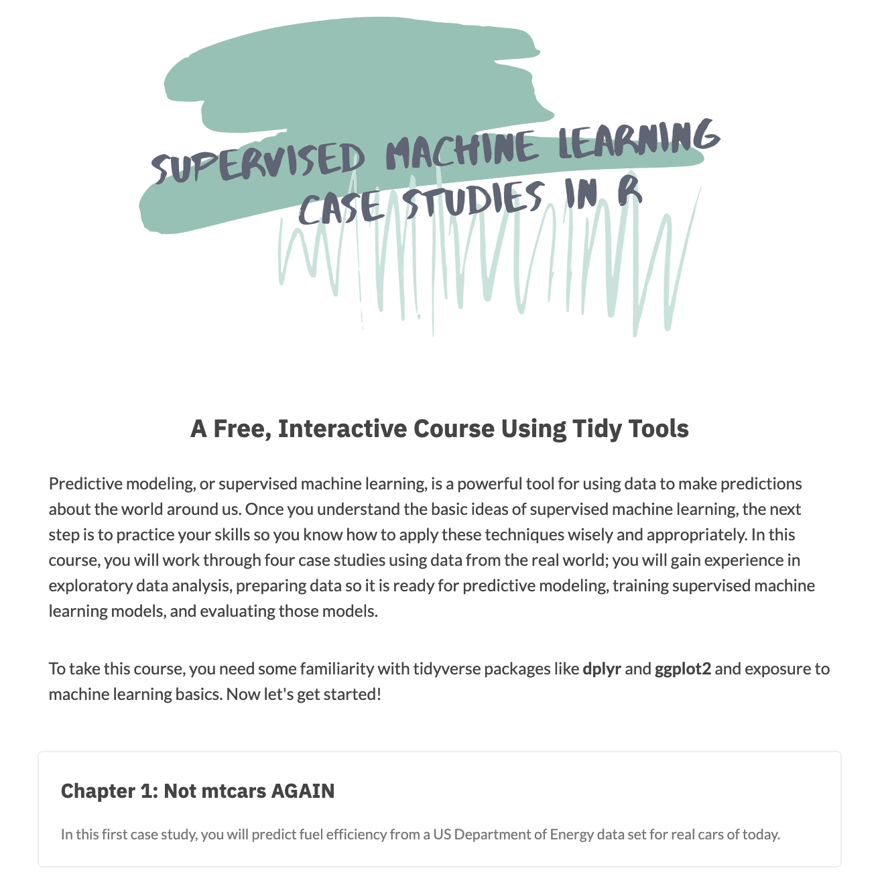

# From Zero to ICSP (Ines Course Starter - Python)

Course Starter python is a starter repo based on the course framework [Ines Montani](https://ines.io/) developed for her [online open-source spaCy course](https://course.spacy.io/). Since creating this framework in April 2019, it has since become a useful tool and platform for Data Scientists and Developers alike to implement their own courses in a manner similar to other popular online Data science educational platforms. 

This course gives the developer the versatility of a lecture slide-type informational piece followed by multiple-choice questions and coding exercises equipped with verification of the students' submitted answers.

Ines Montani has created this framework using Gatsby and Reveal.js in the front-end and Binder and Docker in the back-end. This framework was made possible thanks to the useful JavaScript library [`Juniper`](https://github.com/ines/juniper) Ines created which can add interactive, editable and runnable code snippets to websites. 

***Please Note:***    
This project is under active development and there is a possibility of changes. If you would like to contribute or point out corrections, please create a new issue addressing your concern, suggestions or contribution. 
[](https://course-starter-python.netlify.com)


## What To Expect 

I hope that this thorough documentation will help you deploy, customize and troubleshoot your Starter course. Ines provides some wonderful instructions in her `README.md` file, but I noticed there were a few notes I wanted to add to it for my colleagues and others attempting to make their course so that they can save time on troubleshooting. 

You will be working with different file types including `.md` (and potentially `.rmd`), `.json`, `.py` and `.txt`. 
You may need to know _some_ Html for additional customization, however by no means in-depth. 

let's get started. 

## Setup 

This tutorial will describe the steps to create a complete initial "Starter Course" with zero customization. From here we will then change, edit and add files to complete your desired unique course. 

### Install Node 

**Mac instructions** 

_Make sure that you have homebrew installed in order to download `Node`_

The most important part of this installation is making sure that you are running some version of 10. 


Check if you have `Node` installed already by using the command :
```
node --version
``` 

If that produces an error then you can simply download version 10 with the following command: 

```
brew install node@10
```

If it's a version other than 10, you will **need** to downgrade/upgrade to version 10 - or Gatsby will not be able to start a development server or build a page. 

To change to version 10 follow the following commands:

```
brew search node
```
This will give you an output similar to this: 

```
==> Formulae
libbitcoin-node   node-build     node@12       nodeenv
llnode       node-sass      node_exporter    nodenv
node ✓       node@10       nodebrew
```

Next, you will want to install version 10 with the command: 

```
brew install node@10
```

if the checkmark is currently on `node` we then unlink node from its current version first using: 

```
brew unlink node
```

Everyone will need to link version 10 that was just installed: 

```
brew link node@10
```

This will likely need to be forced and thus will require: 

```
brew link --force --overwrite node@10
```

You may also be prompted to specify that you need to have node@10 first in your PATH so so you should run the command below before attempting force linking node@10 (the command above) again:

```
 echo 'export PATH="/usr/local/opt/node@10/bin:$PATH"' >> ~/.bash_profile 
 ```

Next check again what version you are running to confirm that it is a version of 10. 
there is a possibility that an error will be produced so you can either permanently set your 
```
node --version
``` 
this should output the following: 

```
v10.13.0
```

Now that we have this done, Gatsby's installation and building the page should be must easier. 

### Install Gatsby 

This should a single command to complete this and will install Gatsby globally on your computer. 

```
npm install -g gatsby-cli
```
***NOTE: you will not need to update your dependencies here. 

## Running on local Server 

Next, we must  install all relevant dependencies by running the following: 
```
npm install 
```

***NOTE: you will be prompted to `run "npm audit fix" to fix them`. I do not recommend doing this as it will burn your site down. 
the output below will still build your course: 
```
found 572 vulnerabilities (4 low, 4 moderate, 564 high)
```

and finally to build the site on your local:

```
npm run dev    
```
Delivering this as an output (copy and paste this address into any browser) : 
```
You can now view DSCI-571 in the browser.

  http://localhost:8000/
```


## Customizing 

There is a lot of different areas to make your site unique but below we are going to edit the files systematically. 

### Introduction on homepage
Unlike Ines's [Spacy Course](https://course.spacy.io/), you may want an introduction similar to what [Julia Silge](https://supervised-ml-course.netlify.com/) and [Naome Ross](https://noamross.github.io/gams-in-r-course/) did for their courses. 


|   |  |
|:---:|:---:|
| Julia Silge's course front page| Naome Ross's course front page| 


 
###### caption 

To add this to your course you'll need to edit 


